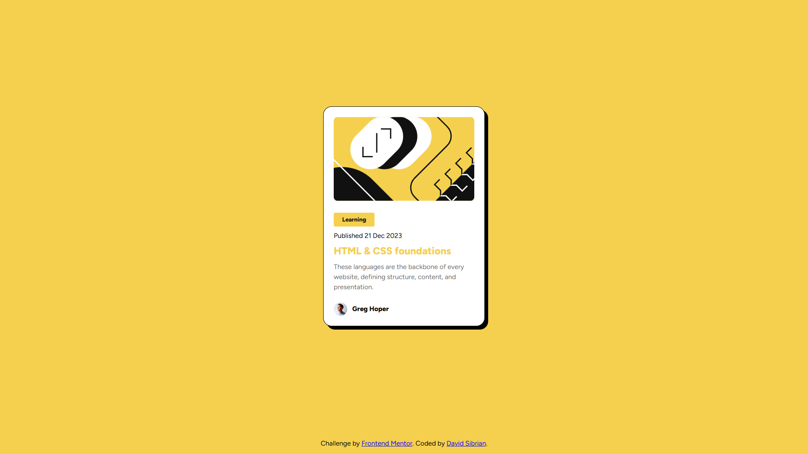

# Frontend Mentor - Blog preview card solution

This is a solution to the [Blog preview card challenge on Frontend Mentor](https://www.frontendmentor.io/challenges/blog-preview-card-ckPaj01IcS). Frontend Mentor challenges help you improve your coding skills by building realistic projects. 

## Table of contents

  - [The challenge](#the-challenge)
  - [Screenshot](#screenshot)
  - [Built with](#built-with)
  - [What I learned](#what-i-learned)
  - [Continued development](#continued-development)

### The challenge

Users should be able to:

- See hover and focus states for all interactive elements on the page

### Screenshot

### Built with

- Semantic HTML5 markup
- CSS custom properties
- Flexbox
- CSS Grid
- Mobile-first workflow
- BEM

### What I learned

I learned to put a shadow under elements :D.

### Continued development

I'd like to focus on a better structuring of html and to correctly name classes with BEM, making the code modular and reusable.
Also write less css code whenever it's possible.

⌁